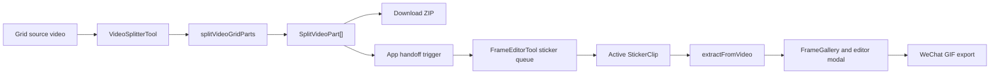

# Video Splitter to Frame Editor Dynamic Sticker Design

## Goal

Frame Forge should let users split a grid-based video into multiple cell videos, then turn those cell videos into separate editable dynamic stickers inside the Frame Editor.

The integration must preserve the current single-sticker editing workflow while adding a clear path from Video Splitter output to one or many sticker-editing entries.

## Current Context

Frame Forge currently has two related but separate tools:

- `VideoSplitterTool` accepts one video, overlays a row/column grid with optional padding and gap, and exports the cropped cell videos as a ZIP.
- `FrameEditorTool` accepts one video, GIF, or static-image batch, extracts frames, edits selected frames, previews animation, and exports a WeChat-ready GIF.

The existing Header already supports a limited cross-tool append path into the Frame Editor, but that path is designed for adding files to the current frame sequence. It should not be used directly for split cell videos, because multiple cell videos represent multiple stickers, not one long animation timeline.

## Recommended Approach

Use a two-stage integration:

1. Change the splitter processing model so it can return structured split parts in memory, not only a ZIP.
2. Add a sticker-clip queue to Frame Editor so each split part becomes its own dynamic sticker candidate.

This keeps the existing frame gallery, modal editor, cleanup tools, preview, readiness check, and GIF export focused on one active sticker at a time. The queue only manages which sticker clip is currently active.

## Alternatives Considered

### Single Cell Handoff

The splitter can expose an "Edit this cell" action that sends one cropped video to Frame Editor.

This is the smallest implementation and has low risk. It is too manual for 4x4 and larger grids because users must repeat the handoff and export cycle many times.

### Batch Queue Handoff

The splitter can expose "Send all to Frame Editor" and optional per-cell send actions. Frame Editor receives each cell video as a separate queued sticker clip.

This is the recommended first implementation. It handles the real multi-sticker workflow without forcing a full batch-processing engine into the first release.

### Full Batch Automation

The splitter can send all cell videos, Frame Editor can auto-extract every clip, and the app can batch-export all GIFs into a ZIP.

This is useful later, but it increases memory pressure, progress orchestration, failure recovery, and export validation complexity. It should build on top of the queue model after the manual queue workflow is solid.

## Data Model

Add a structured splitter output type:

```ts
export interface SplitVideoPart {
  row: number;
  col: number;
  filename: string;
  blob: Blob;
  file: File;
  width: number;
  height: number;
}
```

Refactor splitter utilities into:

- `splitVideoGridParts(...)`: crops the source video and returns `SplitVideoPart[]`.
- `createSplitZip(parts)`: packages existing parts into a ZIP blob.
- `splitVideoGrid(...)`: optional compatibility wrapper that returns a ZIP for existing callers.

Add a Frame Editor queue type:

```ts
export interface StickerClip {
  id: string;
  name: string;
  sourceFile: File;
  row?: number;
  col?: number;
  frames: ExtractedFrame[];
  gifDelay: number;
  exportWidth: number;
  exportHeight: number;
  status: 'queued' | 'extracting' | 'ready' | 'edited' | 'error';
  errorMessage?: string;
}
```

The active clip's `frames` are edited by the existing editor surface. Switching clips persists the current clip's frames before loading the next clip's frames into the gallery.

## User Flow

1. User imports a grid source video in Video Splitter.
2. User configures rows, columns, gap, padding, and audio removal.
3. User runs the split process.
4. The splitter shows a result grid with small video previews and filenames.
5. User can download the ZIP as before.
6. User can send one cell or all cells to Frame Editor.
7. App switches to Frame Editor.
8. Frame Editor shows a sticker queue and selects the first incoming clip.
9. User extracts frames for the active clip using the existing FPS and trim controls.
10. User edits, cleans, previews, and exports that sticker.
11. User switches to the next clip and repeats.

## Component Changes

### `VideoSplitterTool`

Add local state for split results:

- `splitParts: SplitVideoPart[]`
- `selectedPartIds` if per-cell selection is needed

After splitting, keep the existing ZIP download behavior available, but do not force download as the only outcome.

Add actions:

- `Download ZIP`
- `Edit selected in Frame Editor`
- `Edit all in Frame Editor`

The result grid should use real video previews from the generated blobs through object URLs and revoke those URLs when results are replaced or the tool unmounts.

### `App`

Add cross-tool state for incoming sticker clips:

```ts
const [incomingStickerClips, setIncomingStickerClips] = useState<{ parts: SplitVideoPart[]; id: number } | undefined>();
```

Pass an `onSendToFrameEditor(parts)` callback into `VideoSplitterTool`. The callback sets incoming parts and switches `activeTool` to `frame`.

Pass the incoming trigger to `FrameEditorTool`.

### `FrameEditorTool`

Add queue state:

- `clips: StickerClip[]`
- `activeClipId: string | null`

When incoming split parts arrive, convert each part into a `StickerClip` with `status: 'queued'`.

For backward compatibility, direct imports still behave like the current single-sticker flow. Internally, they can either continue to use the current state path or be represented as a single active `StickerClip`. The first implementation should choose the smaller change, as long as split parts do not merge into one `frames` array.

Add a compact queue rail above or beside `FrameGallery` when more than one clip exists. Each item shows:

- row/column or filename
- status
- frame count when extracted
- active state

### `FrameEditorModal`, `FrameGallery`, `RightSidebar`

These components should remain mostly unchanged. They operate on the active clip's frames and settings.

## Data Flow



## Error Handling

Splitter errors should keep their current behavior: show a toast and leave the source video/settings intact.

If some cell videos are generated before a later FFmpeg error, the first implementation may discard the partial result to avoid presenting an incomplete grid as successful. Later versions can support partial recovery.

Frame Editor clip extraction errors should mark only that clip as `error`. Other queued clips must remain available.

If the user leaves Frame Editor while a clip extraction is running, the current behavior can remain: allow the async operation to finish and update state if the component is still mounted. Abort support can be added later.

## Performance and Memory

The first queue implementation should not auto-extract all split videos. Keeping generated cell videos as `File` objects is cheaper than immediately creating full PNG data URLs for every frame of every clip.

Only the active clip should extract and render frame data. This avoids a 4x4 grid producing sixteen full frame sequences in React state at once.

Object URLs created for split result previews and frame data must be revoked when replaced or removed.

## Testing

Add unit tests for splitter utility refactoring:

- `splitVideoGridParts` returns row/column metadata and file names in stable row-major order.
- `createSplitZip` includes every part filename.
- invalid padding/gap still rejects before processing.

Add Frame Editor state tests where practical:

- incoming split parts create separate clip entries.
- selecting a different clip does not merge frames.
- extracting one clip updates only that clip.

Add manual browser verification:

- Split a 4x4 source video.
- Confirm ZIP download still works.
- Send all cells to Frame Editor.
- Extract and export one active cell as a WeChat GIF.
- Switch to another cell and confirm it starts as a separate queued sticker.

## Scope Boundaries

In scope for the first implementation:

- Structured split parts.
- ZIP export preservation.
- Send one or all split parts to Frame Editor.
- Frame Editor sticker queue.
- Per-clip extraction, editing, preview, and single GIF export.

Out of scope for the first implementation:

- Automatic extraction of every queued clip.
- Batch GIF export ZIP.
- Sticker pack metadata.
- WeChat submission automation.
- Multi-clip synchronized timeline editing.

## Open Product Decisions

The first implementation should default to "Edit all in Frame Editor" after split results are available, while preserving ZIP download as a secondary action.

The queue should treat row-major order as the canonical order: `part_0_0`, `part_0_1`, through the final row and column.

The active clip should inherit the current Frame Editor defaults: 10 FPS extraction and 240 x 240 WeChat GIF export.
